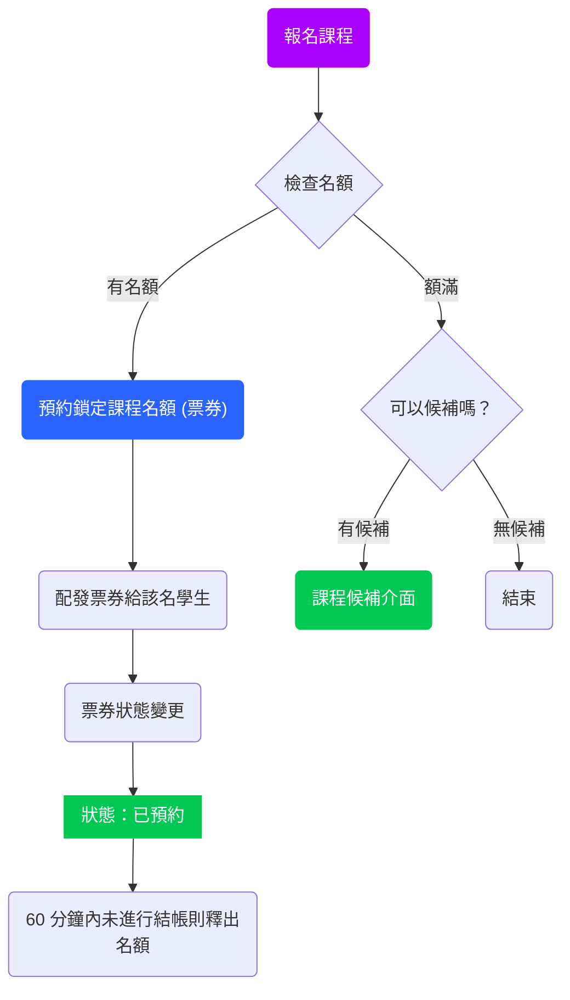
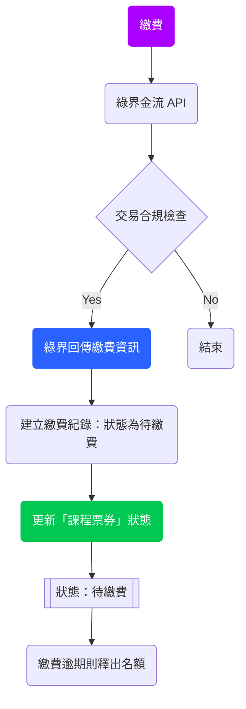

# 線上選課報名流程 - 1 (報名)

```mermaid
flowchart TD
%% Nodes
StartA("報名課程")
C1{"檢查名額"}
C2{"可以候補嗎？"}
Cart("預約鎖定課程名額 (票券)")
AssignLock("配發票券給該名學生")
StateChange("票券狀態變更")

StateReserved[["狀態：已預約"]]
Free("60 分鐘內未進行結帳則釋出名額")

Candidate("課程候補介面")
End("結束")


%% Edge connections between nodes
StartA --> C1
C1 -- 有名額 --> Cart --> AssignLock --> StateChange --> StateReserved
C1 -- 額滿 --> C2
C2 -- 有候補 --> Candidate
C2 -- 無候補 --> End

StateReserved --> Free


%% Individual node styling. Try the visual editor toolbar for easier styling!
    style StartA color:#FFFFFF, fill:#AA00FF, stroke:#AA00FF
    style Candidate color:#FFFFFF, stroke:#00C853, fill:#00C853
    style StateReserved color:#FFFFFF, stroke:#00C853, fill:#00C853
    style Cart color:#FFFFFF, stroke:#2962FF, fill:#2962FF

```

# 線上選課報名流程 - 2 繳費

```mermaid
flowchart TD
%% Nodes
StartA("繳費")
GreenAPI("綠界金流 API")
StatePending[["狀態：待繳費"]]

C1{"交易合規檢查"}

Cart("綠界回傳繳費資訊")
Cart1("建立繳費紀錄：狀態為待繳費")
Cart2("更新「課程票券」狀態")

Free("繳費逾期則釋出名額")
End("結束")


%% Edge connections between nodes
StartA  --> GreenAPI
GreenAPI --> C1
C1 -- Yes --> Cart --> Cart1 --> Cart2 --> StatePending
C1 -- No --> End

StatePending --> Free


%% Individual node styling. Try the visual editor toolbar for easier styling!
    style StartA color:#FFFFFF, fill:#AA00FF, stroke:#AA00FF
    style Cart2 color:#FFFFFF, stroke:#00C853, fill:#00C853
    style Cart color:#FFFFFF, stroke:#2962FF, fill:#2962FF

```

